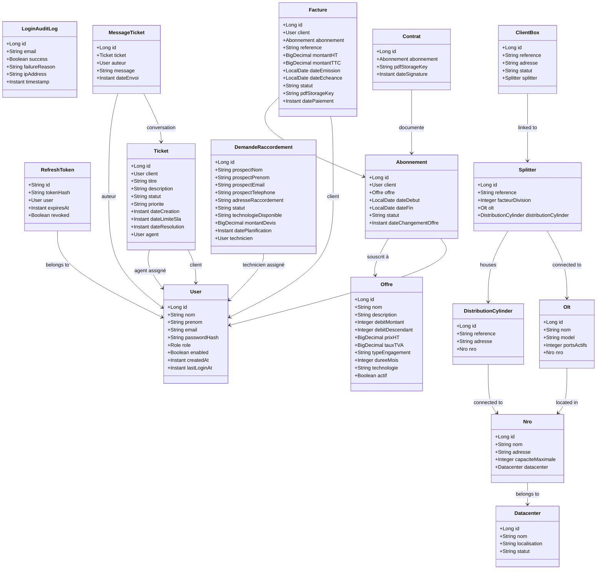

# 🏗️ GUIDE DE DÉVELOPPEMENT MONOLITHE SPRING BOOT — Fibre Optique Platform

Ce document est le guide complet et unique pour développer la **Fibre Optique Platform** sous la forme d'un **projet Spring Boot unique et simple**, sans architecture microservices (pas d'Eureka, pas de Config Server, pas de Gateway complexe) et **sans RabbitMQ / AMQP** (remplacé par des appels directs de services et des événements in-memory Spring `ApplicationEventPublisher` pour le découplage simple).

---

## 1. Structure Globale du Projet

Le projet est structuré comme un **Monolithe Modulaire** dans un seul projet Maven. Chaque domaine fonctionnel est isolé dans son propre package avec ses contrôleurs, services, entités JPA et repositories.

### 1.1 Arborescence des Sources

```
fibre-optique-platform/
├── pom.xml
└── src/
    ├── main/
    │   ├── java/com/fibre/optique/
    │   │   ├── FibreOptiqueApplication.java   # Classe Main unique avec @EnableScheduling et @EnableAsync
    │   │   │
    │   │   ├── auth/                          # 1. Sécurité et Authentification (JWT, Roles)
    │   │   │   ├── controller/
    │   │   │   │   └── AuthController.java
    │   │   │   ├── service/
    │   │   │   │   ├── AuthService.java
    │   │   │   │   └── TokenService.java
    │   │   │   ├── model/
    │   │   │   │   ├── RefreshToken.java
    │   │   │   │   └── LoginAuditLog.java
    │   │   │   └── repository/
    │   │   │       ├── RefreshTokenRepository.java
    │   │   │       └── LoginAuditLogRepository.java
    │   │   │
    │   │   ├── user/                          # 2. Utilisateurs et Profils
    │   │   │   ├── controller/
    │   │   │   │   └── UserController.java
    │   │   │   ├── service/
    │   │   │   │   └── UserService.java
    │   │   │   ├── model/
    │   │   │   │   └── User.java
    │   │   │   └── repository/
    │   │   │       └── UserRepository.java
    │   │   │
    │   │   ├── network/                       # 3. Infrastructures Réseau et Éligibilité
    │   │   │   ├── controller/
    │   │   │   │   ├── DatacenterController.java
    │   │   │   │   ├── NroController.java
    │   │   │   │   ├── SplitterController.java
    │   │   │   │   └── EligibilityController.java
    │   │   │   ├── service/
    │   │   │   │   └── NetworkService.java
    │   │   │   ├── model/
    │   │   │   │   ├── Datacenter.java
    │   │   │   │   ├── Nro.java
    │   │   │   │   ├── Olt.java
    │   │   │   │   ├── DistributionCylinder.java
    │   │   │   │   ├── Splitter.java
    │   │   │   │   ├── ClientBox.java
    │   │   │   │   └── FiberPath.java
    │   │   │   └── repository/
    │   │   │       ├── DatacenterRepository.java
    │   │   │       ├── NroRepository.java
    │   │   │       ├── OltRepository.java
    │   │   │       ├── DistributionCylinderRepository.java
    │   │   │       ├── SplitterRepository.java
    │   │   │       ├── ClientBoxRepository.java
    │   │   │       └── FiberPathRepository.java
    │   │   │
    │   │   ├── offer/                         # 4. Catalogue d'Offres Commerciales
    │   │   │   ├── controller/
    │   │   │   │   └── OfferController.java
    │   │   │   ├── service/
    │   │   │   │   └── OfferService.java
    │   │   │   ├── model/
    │   │   │   │   └── Offre.java
    │   │   │   └── repository/
    │   │   │       └── OfferRepository.java
    │   │   │
    │   │   ├── subscription/                  # 5. Abonnements et Contrats
    │   │   │   ├── controller/
    │   │   │   │   └── SubscriptionController.java
    │   │   │   ├── service/
    │   │   │   │   ├── SubscriptionService.java
    │   │   │   │   └── ContractPdfService.java
    │   │   │   ├── model/
    │   │   │   │   ├── Abonnement.java
    │   │   │   │   └── Contrat.java
    │   │   │   └── repository/
    │   │   │       ├── AbonnementRepository.java
    │   │   │       └── ContratRepository.java
    │   │   │
    │   │   ├── billing/                       # 6. Factures et Paiements
    │   │   │   ├── controller/
    │   │   │   │   └── BillingController.java
    │   │   │   ├── service/
    │   │   │   │   ├── BillingService.java
    │   │   │   │   └── InvoicePdfService.java
    │   │   │   ├── model/
    │   │   │   │   └── Facture.java
    │   │   │   ├── repository/
    │   │   │   │   └── FactureRepository.java
    │   │   │   └── scheduler/
    │   │   │       └── BillingScheduler.java
    │   │   │
    │   │   ├── request/                       # 7. Demandes de Raccordement (Éligibilité & Devis)
    │   │   │   ├── controller/
    │   │   │   │   └── RequestController.java
    │   │   │   ├── service/
    │   │   │   │   └── RequestService.java
    │   │   │   ├── model/
    │   │   │   │   └── DemandeRaccordement.java
    │   │   │   └── repository/
    │   │   │       └── DemandeRaccordementRepository.java
    │   │   │
    │   │   ├── support/                       # 8. Support Ticket & SLA
    │   │   │   ├── controller/
    │   │   │   │   └── SupportController.java
    │   │   │   ├── service/
    │   │   │   │   └── SupportService.java
    │   │   │   ├── model/
    │   │   │   │   ├── Ticket.java
    │   │   │   │   └── MessageTicket.java
    │   │   │   ├── repository/
    │   │   │   │   ├── TicketRepository.java
    │   │   │   │   └── MessageTicketRepository.java
    │   │   │   └── scheduler/
    │   │   │       └── SupportSlaScheduler.java
    │   │   │
    │   │   ├── notification/                  # 9. Service de Notifications (Email, SMS, In-App)
    │   │   │   ├── service/
    │   │   │   │   └── NotificationService.java
    │   │   │   ├── model/
    │   │   │   │   └── Notification.java
    │   │   │   ├── repository/
    │   │   │   │   └── NotificationRepository.java
    │   │   │   └── listener/
    │   │   │       └── LocalNotificationEventListener.java # Écouteur d'événements Spring internes
    │   │   │
    │   │   ├── common/                        # 10. Partagé Transverse (Exceptions, Sécurité JWT)
    │   │   │   ├── exception/
    │   │   │   │   └── GlobalExceptionHandler.java
    │   │   │   ├── security/
    │   │   │   │   ├── SecurityConfig.java
    │   │   │   │   ├── JwtAuthenticationFilter.java
    │   │   │   │   └── CustomUserDetailsService.java
    │   │   │   └── dto/
    │   │   │       └── ErrorResponse.java
    │   │   │
    │   │   └── config/                        # 11. Configuration Globale
    │   │       └── AppConfig.java
    │   │
    │   └── resources/
    │       ├── application.yml
    │       ├── templates/                     # Templates d'emails (Thymeleaf/HTML)
    │       │   ├── request_submitted.html
    │       │   ├── subscription_created.html
    │       │   ├── invoice_generated.html
    │       │   └── ticket_reply.html
    │       └── db/migration/                  # Flyway Migrations unifiées (optionnel)
```

---

## 2. Communication Directe et Événements Internes

Pour remplacer l'architecture asynchrone complexe et les appels réseaux (Feign clients, RabbitMQ), nous utilisons deux mécanismes simples natifs à Spring :

1. **Injection Directe de Services** : Lorsqu'un module a besoin d'une information synchrone ou d'une validation auprès d'un autre module (ex: `SubscriptionService` valide qu'une offre existe), il injecte directement le service correspondant (`OfferService`) par son constructeur Java.
2. **Spring Events (`ApplicationEventPublisher`)** : Pour les notifications ou les actions asynchrones non bloquantes, les modules publient des événements Spring Java simples. Le module `notification` écoute ces événements et envoie les emails.

### Exemple de publication d'événement Spring

Dans `SubscriptionService.java` :
```java
@Autowired
private ApplicationEventPublisher eventPublisher;

@Transactional
public Abonnement createSubscription(Long clientId, Long offerId) {
    // 1. Validation directe inter-module (Appel Java direct)
    User client = userService.getUserById(clientId);
    Offre offre = offerService.getOfferById(offerId);
    
    // 2. Logique de création
    Abonnement abonnement = new Abonnement(client, offre, LocalDate.now());
    abonnementRepository.save(abonnement);
    
    // 3. Notification asynchrone locale sans RabbitMQ
    eventPublisher.publishEvent(new SubscriptionCreatedEvent(this, abonnement.getId(), client.getEmail(), offre.getNom()));
    
    return abonnement;
}
```

Dans `LocalNotificationEventListener.java` :
```java
@Component
public class LocalNotificationEventListener {

    @Autowired
    private NotificationService notificationService;

    @EventListener
    @Async // Exécution en tâche de fond simple
    public void onSubscriptionCreated(SubscriptionCreatedEvent event) {
        notificationService.sendEmail(
            event.getClientEmail(),
            "Votre abonnement Fibre a été activé !",
            "Bonjour, votre abonnement à l'offre " + event.getOfferName() + " est actif."
        );
    }
}
```

---

## 3. Schéma de Base de Données Unifié

Toutes les tables sont stockées dans une base de données unique (`fibre_optique_db`).

```sql
-- ==========================================
-- 1. MODULE USER & AUTH
-- ==========================================
CREATE TABLE users (
    id BIGINT AUTO_INCREMENT PRIMARY KEY,
    nom VARCHAR(100) NOT NULL,
    prenom VARCHAR(100) NOT NULL,
    email VARCHAR(150) NOT NULL UNIQUE,
    password_hash VARCHAR(255) NOT NULL,
    role VARCHAR(30) NOT NULL, -- ADMIN, TECHNICIEN, CLIENT, PROSPECT, COMMERCIAL, SUPPORT
    enabled BOOLEAN DEFAULT TRUE,
    created_at TIMESTAMP DEFAULT CURRENT_TIMESTAMP,
    last_login_at TIMESTAMP NULL
);

CREATE TABLE refresh_tokens (
    id VARCHAR(100) PRIMARY KEY,
    token_hash VARCHAR(255) NOT NULL,
    user_id BIGINT NOT NULL,
    expires_at TIMESTAMP NOT NULL,
    revoked BOOLEAN DEFAULT FALSE,
    FOREIGN KEY (user_id) REFERENCES users(id) ON DELETE CASCADE
);

CREATE TABLE login_audit_logs (
    id BIGINT AUTO_INCREMENT PRIMARY KEY,
    email VARCHAR(150) NOT NULL,
    success BOOLEAN NOT NULL,
    failure_reason VARCHAR(255) NULL,
    ip_address VARCHAR(45) NULL,
    timestamp TIMESTAMP DEFAULT CURRENT_TIMESTAMP
);

-- ==========================================
-- 2. MODULE NETWORK
-- ==========================================
CREATE TABLE net_datacenters (
    id BIGINT AUTO_INCREMENT PRIMARY KEY,
    nom VARCHAR(100) NOT NULL,
    localisation VARCHAR(255) NOT NULL,
    statut VARCHAR(50) NOT NULL -- OPERATIONNEL, MAINTENANCE, PANNE
);

CREATE TABLE net_nros (
    id BIGINT AUTO_INCREMENT PRIMARY KEY,
    nom VARCHAR(100) NOT NULL,
    adresse VARCHAR(255) NOT NULL,
    capacite_maximale INT NOT NULL,
    datacenter_id BIGINT NOT NULL,
    FOREIGN KEY (datacenter_id) REFERENCES net_datacenters(id)
);

CREATE TABLE net_olts (
    id BIGINT AUTO_INCREMENT PRIMARY KEY,
    nom VARCHAR(100) NOT NULL,
    model VARCHAR(100) NOT NULL,
    ports_actifs INT NOT NULL,
    nro_id BIGINT NOT NULL,
    FOREIGN KEY (nro_id) REFERENCES net_nros(id)
);

CREATE TABLE net_distribution_cylinders (
    id BIGINT AUTO_INCREMENT PRIMARY KEY,
    reference VARCHAR(100) NOT NULL UNIQUE,
    adresse VARCHAR(255) NOT NULL,
    nro_id BIGINT NOT NULL,
    FOREIGN KEY (nro_id) REFERENCES net_nros(id)
);

CREATE TABLE net_splitters (
    id BIGINT AUTO_INCREMENT PRIMARY KEY,
    reference VARCHAR(100) NOT NULL UNIQUE,
    facteur_division INT NOT NULL, -- 32 ou 64
    olt_id BIGINT NOT NULL,
    distribution_cylinder_id BIGINT NOT NULL,
    FOREIGN KEY (olt_id) REFERENCES net_olts(id),
    FOREIGN KEY (distribution_cylinder_id) REFERENCES net_distribution_cylinders(id)
);

CREATE TABLE net_client_boxes (
    id BIGINT AUTO_INCREMENT PRIMARY KEY,
    reference VARCHAR(100) NOT NULL UNIQUE,
    adresse VARCHAR(255) NOT NULL,
    statut VARCHAR(50) NOT NULL, -- LIBRE, OCCUPE, RESERVE
    splitter_id BIGINT NOT NULL,
    FOREIGN KEY (splitter_id) REFERENCES net_splitters(id)
);

CREATE TABLE net_fiber_paths (
    id BIGINT AUTO_INCREMENT PRIMARY KEY,
    origine VARCHAR(100) NOT NULL, -- ex: "NRO-1"
    destination VARCHAR(100) NOT NULL, -- ex: "CYL-1"
    distance_metres INT NOT NULL,
    statut VARCHAR(50) NOT NULL -- OK, INCIDENT
);

-- ==========================================
-- 3. MODULE OFFER
-- ==========================================
CREATE TABLE offres (
    id BIGINT AUTO_INCREMENT PRIMARY KEY,
    nom VARCHAR(100) NOT NULL,
    description TEXT,
    debit_montant INT NOT NULL, -- Mbps
    debit_descendant INT NOT NULL, -- Mbps
    prix_ht DECIMAL(10,2) NOT NULL,
    taux_tva DECIMAL(5,2) DEFAULT 20.00,
    type_engagement VARCHAR(50) NOT NULL, -- SANS_ENGAGEMENT, DOUZE_MOIS, VINGT_QUATRE_MOIS
    duree_mois INT NOT NULL DEFAULT 0,
    technologie VARCHAR(20) NOT NULL, -- FTTH, FTTB
    actif BOOLEAN DEFAULT TRUE
);

-- ==========================================
-- 4. MODULE SUBSCRIPTION
-- ==========================================
CREATE TABLE abonnements (
    id BIGINT AUTO_INCREMENT PRIMARY KEY,
    client_id BIGINT NOT NULL,
    offre_id BIGINT NOT NULL,
    date_debut DATE NOT NULL,
    date_fin DATE NULL,
    statut VARCHAR(30) NOT NULL, -- ACTIF, SUSPENDU, RESILIE
    date_changement_offre TIMESTAMP NULL,
    FOREIGN KEY (client_id) REFERENCES users(id),
    FOREIGN KEY (offre_id) REFERENCES offres(id)
);

CREATE TABLE contrats (
    id BIGINT AUTO_INCREMENT PRIMARY KEY,
    abonnement_id BIGINT NOT NULL,
    pdf_storage_key VARCHAR(255) NOT NULL,
    date_signature TIMESTAMP DEFAULT CURRENT_TIMESTAMP,
    FOREIGN KEY (abonnement_id) REFERENCES abonnements(id) ON DELETE CASCADE
);

-- ==========================================
-- 5. MODULE BILLING
-- ==========================================
CREATE TABLE factures (
    id BIGINT AUTO_INCREMENT PRIMARY KEY,
    client_id BIGINT NOT NULL,
    abonnement_id BIGINT NOT NULL,
    reference VARCHAR(100) NOT NULL UNIQUE, -- ex: "FAC-2026-0001"
    montant_ht DECIMAL(10,2) NOT NULL,
    montant_ttc DECIMAL(10,2) NOT NULL,
    date_emission DATE NOT NULL,
    date_echeance DATE NOT NULL,
    statut VARCHAR(30) NOT NULL, -- EN_ATTENTE, PAYEE, EN_RETARD, ANNULEE
    pdf_storage_key VARCHAR(255) NULL,
    date_paiement TIMESTAMP NULL,
    FOREIGN KEY (client_id) REFERENCES users(id),
    FOREIGN KEY (abonnement_id) REFERENCES abonnements(id)
);

-- ==========================================
-- 6. MODULE REQUEST
-- ==========================================
CREATE TABLE demandes_raccordement (
    id BIGINT AUTO_INCREMENT PRIMARY KEY,
    prospect_nom VARCHAR(100) NOT NULL,
    prospect_prenom VARCHAR(100) NOT NULL,
    prospect_email VARCHAR(150) NOT NULL,
    prospect_telephone VARCHAR(20) NOT NULL,
    adresse_raccordement VARCHAR(255) NOT NULL,
    statut VARCHAR(50) NOT NULL, -- ELEGIBILITE_VERIFIEE, DEVIS_GENERE, ACCEPTE, PLANIFIE, TERMINE, REJETE
    technologie_disponible VARCHAR(20) NULL,
    montant_devis DECIMAL(10,2) NULL,
    date_planification TIMESTAMP NULL,
    technicien_id BIGINT NULL,
    created_at TIMESTAMP DEFAULT CURRENT_TIMESTAMP,
    FOREIGN KEY (technicien_id) REFERENCES users(id)
);

-- ==========================================
-- 7. MODULE SUPPORT
-- ==========================================
CREATE TABLE tickets (
    id BIGINT AUTO_INCREMENT PRIMARY KEY,
    client_id BIGINT NOT NULL,
    titre VARCHAR(150) NOT NULL,
    description TEXT NOT NULL,
    statut VARCHAR(30) NOT NULL, -- OUVERT, EN_COURS, RESOLU, FERME
    priorite VARCHAR(20) NOT NULL, -- BASSE, MOYENNE, HAUTE, CRITIQUE
    date_creation TIMESTAMP DEFAULT CURRENT_TIMESTAMP,
    date_limite_sla TIMESTAMP NOT NULL,
    date_resolution TIMESTAMP NULL,
    agent_id BIGINT NULL,
    FOREIGN KEY (client_id) REFERENCES users(id),
    FOREIGN KEY (agent_id) REFERENCES users(id)
);

CREATE TABLE messages_ticket (
    id BIGINT AUTO_INCREMENT PRIMARY KEY,
    ticket_id BIGINT NOT NULL,
    auteur_id BIGINT NOT NULL,
    message TEXT NOT NULL,
    date_envoi TIMESTAMP DEFAULT CURRENT_TIMESTAMP,
    FOREIGN KEY (ticket_id) REFERENCES tickets(id) ON DELETE CASCADE,
    FOREIGN KEY (auteur_id) REFERENCES users(id)
);

-- ==========================================
-- 8. MODULE NOTIFICATION
-- ==========================================
CREATE TABLE notifications (
    id BIGINT AUTO_INCREMENT PRIMARY KEY,
    destinataire VARCHAR(150) NOT NULL,
    sujet VARCHAR(255) NOT NULL,
    contenu TEXT NOT NULL,
    type_canal VARCHAR(20) NOT NULL, -- EMAIL, SMS, IN_APP
    statut VARCHAR(20) NOT NULL, -- EN_ATTENTE, ENVOYE, ECHEC
    created_at TIMESTAMP DEFAULT CURRENT_TIMESTAMP,
    sent_at TIMESTAMP NULL
);
```

---

## 4. Spécifications Détaillées des Modules

Chaque module s'articule autour de cas d'utilisation simples, de routes REST définies et de services métiers autonomes.

---

### 4.1 Module `auth` & `user`

*   **Responsabilités** :
    *   Authentification sécurisée (Spring Security + JWT).
    *   Gestion CRUD des utilisateurs (Prospects, Clients, Techniciens, Support, Commerciaux, Admins).
    *   Mise à jour de la dernière connexion et logs d'audit.
*   **Contrôleurs REST** :
    *   `POST /api/v1/auth/login` : Authentification et retour des tokens JWT + Refresh.
    *   `POST /api/v1/auth/refresh` : Rafraîchir un JWT expiré.
    *   `POST /api/v1/auth/logout` : Révocation du Refresh Token.
    *   `POST /api/v1/users` : Inscription/Création d'un utilisateur (rôle assigné par défaut: `PROSPECT` ou selon l'utilisateur créateur).
    *   `GET /api/v1/users/me` : Détails du profil connecté.
    *   `GET /api/v1/users` : Recherche et filtrage paginé des utilisateurs (Réservé `ADMIN`).
*   **Services** :
    *   `AuthService` : Valide les identifiants, hash les mots de passe, gère la sécurité.
    *   `TokenService` : Génère et valide les JWT et gère l'état et l'expiration des `RefreshToken`.
    *   `UserService` : CRUD standard sur la table `users`.

---

### 4.2 Module `network` (Gestion Réseau & Éligibilité)

*   **Responsabilités** :
    *   Modéliser l'infrastructure physique de raccordement fibre.
    *   Vérifier l'éligibilité d'une adresse donnée.
*   **Contrôleurs REST** :
    *   `GET /api/v1/network/eligibility?address={address}` : Analyse de la distance aux cylindres de distribution et splitters. Renvoie `true/false` et la technologie disponible.
    *   `POST /api/v1/network/datacenters` : Enregistrement de nouveaux datacenters (`ADMIN`).
    *   `GET /api/v1/network/status` : Cartographie complète de l'état du réseau (incidents sur `FiberPath`).
*   **Logique d'Éligibilité** :
    *   Un client ou prospect est éligible si sa distance estimée à un `DistributionCylinder` ou `ClientBox` libre est inférieure à **500 mètres**.
    *   Le service vérifie la disponibilité d'un port libre (`LIBRE`) dans la table `net_client_boxes` associée aux splitters et OLTs.

---

### 4.3 Module `offer` & `subscription`

*   **Responsabilités** :
    *   Gestion du catalogue d'offres de fibre optique (prix, débits, technologies).
    *   Création et cycle de vie d'un abonnement client (ACTIF, SUSPENDU, RESILIE).
    *   Génération de contrat PDF.
*   **Contrôleurs REST** :
    *   `GET /api/v1/offers` : Liste les offres actives pour le public.
    *   `POST /api/v1/offers` : Ajouter une offre au catalogue (`ADMIN`).
    *   `POST /api/v1/subscriptions` : Souscrire un client à une offre (`COMMERCIAL`, `ADMIN`). Génère automatiquement le contrat PDF associé.
    *   `PUT /api/v1/subscriptions/{id}/suspend` : Suspendre temporairement (défaut de paiement, choix client).
    *   `PUT /api/v1/subscriptions/{id}/resilie` : Résilier l'abonnement.
    *   `GET /api/v1/subscriptions/{id}/contract` : Télécharger le PDF du contrat.
*   **Génération de Contrats** :
    *   `ContractPdfService` : Utilise une bibliothèque simple comme **iText** ou **OpenPDF** pour générer un fichier PDF avec les détails du client, de l'offre et les signatures. Stocké localement (ou sur un répertoire partagé configuré).

---

### 4.4 Module `billing` (Facturation)

*   **Responsabilités** :
    *   Génération automatique des factures mensuelles pour chaque abonnement actif.
    *   Relance des factures impayées.
*   **Contrôleurs REST** :
    *   `GET /api/v1/billing/my-invoices` : Historique des factures du client connecté.
    *   `POST /api/v1/billing/{id}/pay` : Simuler ou enregistrer le paiement d'une facture.
*   **Tâches Planifiées (`@Scheduled`)** :
    *   `BillingScheduler.generateMonthlyInvoices()` : S'exécute le **1er du mois à 01:00 AM**. Il recherche tous les abonnements au statut `ACTIF`, calcule le montant TTC à partir du prix HT de l'offre liée, crée une ligne `factures` et émet l'événement `InvoiceGeneratedEvent` pour envoi d'email.
    *   `BillingScheduler.checkLatePayments()` : S'exécute **chaque jour à 03:00 AM**. Toutes les factures dont l'état est `EN_ATTENTE` et dont la date d'échéance est dépassée passent au statut `EN_RETARD`. Une relance email est déclenchée.

---

### 4.5 Module `request` (Demandes de Raccordement)

*   **Responsabilités** :
    *   Permettre aux prospects de soumettre une demande de raccordement.
    *   Permettre aux commerciaux de générer un devis d'installation.
    *   Permettre aux techniciens de planifier et d'indiquer la fin du raccordement physique.
*   **Contrôleurs REST** :
    *   `POST /api/v1/requests` : Soumission d'une demande par un prospect (adresse, contact).
    *   `PUT /api/v1/requests/{id}/devis` : Renseignement du montant du devis d'installation (`COMMERCIAL`).
    *   `PUT /api/v1/requests/{id}/accept` : Acceptation du devis par le prospect. Le statut passe à `ACCEPTE`.
    *   `PUT /api/v1/requests/{id}/schedule` : Assigner un technicien et une date de planification (`ADMIN`, `COMMERCIAL`).
    *   `PUT /api/v1/requests/{id}/complete` : Le technicien valide la fin du raccordement.
*   **Déclenchement Automatique** :
    *   Une fois la demande raccordée (`TERMINE`), le système crée automatiquement le compte utilisateur final et déclenche la souscription de l'abonnement configuré.

---

### 4.6 Module `support` (Tickets & SLA)

*   **Responsabilités** :
    *   Gestion des demandes d'assistance des abonnés.
    *   Vérification et escalade automatique selon l'engagement de niveau de service (SLA).
*   **Contrôleurs REST** :
    *   `POST /api/v1/tickets` : Création d'un ticket d'incident par un client ou un agent.
    *   `POST /api/v1/tickets/{id}/replies` : Ajout d'un message dans la discussion du ticket.
    *   `PUT /api/v1/tickets/{id}/resolve` : Clôturer le ticket.
*   **Vérification SLA** :
    *   Lors de la création du ticket, une date limite SLA est calculée selon la priorité (ex : Priorité `CRITIQUE` = SLA de 4 heures ; Priorité `BASSE` = SLA de 48 heures).
    *   `SupportSlaScheduler.checkSlaBreaches()` : Planifié **toutes les heures**. Recherche les tickets non résolus dont la `date_limite_sla` est dépassée, et change leur priorité à `CRITIQUE` en avertissant par email l'administrateur de garde.

---

### 4.7 Module `notification` (Service Transverse de Communication)

*   **Responsabilités** :
    *   Envoi des emails réels ou simulés (logs console en développement).
    *   Consigne et archivage de toutes les notifications émises.
*   **Technologie** :
    *   Utilise `JavaMailSender` de Spring Boot connecté à un serveur SMTP local (ex: Maildev ou GreenMail) en développement.
    *   Écoute les événements d'application via `@EventListener` Spring Boot.

---

## 5. Diagramme UML des Classes du Monolithe

Le diagramme suivant illustre les modèles métier Java et leurs relations directes JPA :



---

## 6. Configuration du Projet (`application.yml`)

Cette configuration unique remplace les 9 fichiers de configuration séparés des microservices et configure une base de données MySQL locale et un service de messagerie SMTP simple.

```yaml
spring:
  application:
    name: fibre-optique-platform
  
  # Configuration Database Unique
  datasource:
    url: jdbc:mysql://localhost:3306/fibre_optique_db?useSSL=false&serverTimezone=UTC&allowPublicKeyRetrieval=true
    username: root
    password: password
    driver-class-name: com.mysql.cj.jdbc.Driver

  # JPA & Hibernate
  jpa:
    hibernate:
      ddl-auto: update
    show-sql: true
    properties:
      hibernate:
        format_sql: true
        dialect: org.hibernate.dialect.MySQLDialect

  # Configuration Mail Simple (Maildev en local par défaut)
  mail:
    host: localhost
    port: 1025
    username: 
    password: 
    properties:
      mail:
        smtp:
          auth: false
          starttls:
            enable: false

# Sécurité & JWT Config
application:
  security:
    jwt:
      secret-key: 404E635266556A586E3272357538782F413F4428472B4B6250645367566B5970
      expiration: 86400000 # 1 jour en ms
      refresh-token:
        expiration: 604800000 # 7 jours en ms

# Configuration Logging
logging:
  level:
    root: INFO
    com.fibre.optique: DEBUG
    org.springframework.security: INFO
```

---

## 7. Avantages et Simplifications de cette Migration

1. **Aucun overhead réseau** : Les appels entre modules (ex: `billing` qui vérifie le statut d'un `abonnement`) sont des appels de méthode Java en mémoire, ultra-rapides et transactionnels.
2. **Gestion ACID simplifiée** : L'utilisation de `@Transactional` de Spring garantit l'intégrité de la base de données. Pas besoin de gérer des patterns Saga distribués ou de gérer des messages perdus dans des queues d'attente.
3. **Facilité de débogage** : Le projet démarre en 5 secondes avec un simple clic droit "Run" depuis votre IDE ou via `mvn spring-boot:run`, facilitant énormément le cycle de développement par rapport au lancement de 9 microservices.
4. **Maintenance serveur réduite** : Plus besoin de configurer et superviser un cluster RabbitMQ localement, ni Eureka ou Spring Cloud Gateway.


Architecture de nouveau projet :

fibre-optique/

├── pom.xml
├── README.md
│
├── src/
│
├── main/
│   ├── java/
│   │
│   └── com/fibre/optique/
│
│       ├── FibreOptiqueApplication.java
│       │
│       ├── common/
│       │
│       │   ├── config/
│       │   ├── security/
│       │   ├── exception/
│       │   ├── response/
│       │   ├── validation/
│       │   ├── util/
│       │   ├── mapper/
│       │   ├── event/
│       │   ├── constants/
│       │   ├── audit/
│       │   └── base/
│       │
│       ├── auth/
│       ├── user/
│       ├── offer/
│       ├── network/
│       ├── request/
│       ├── subscription/
│       ├── billing/
│       ├── support/
│       └── notification/
│
│
└── resources/


et Chaque module possède exactement la même structure :

user/

    controller/

    service/

    repository/

    entity/

    dto/

    mapper/

    validator/

    exception/

    event/

    listener/

    config/

et 


offer/

    controller/

    service/

    repository/

    entity/

    dto/

    mapper/

    validator/

    exception/

    config/

---
    
> Ce guide constitue le plan de route officiel pour assembler l'ensemble des fonctionnalités de la Fibre Optique Platform dans un projet unifié et propre.
